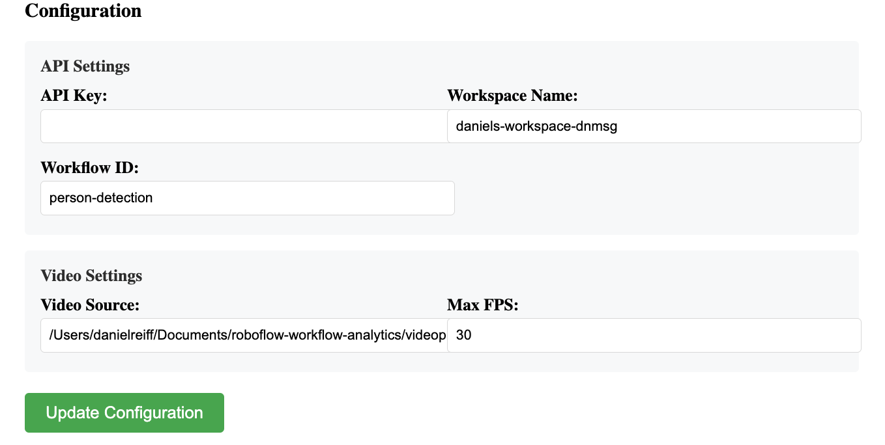
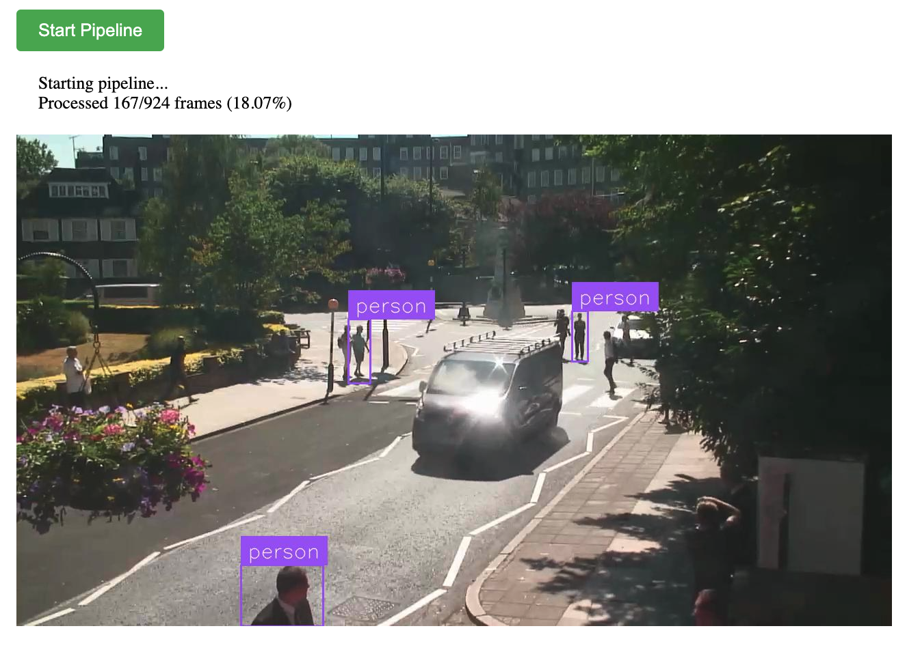
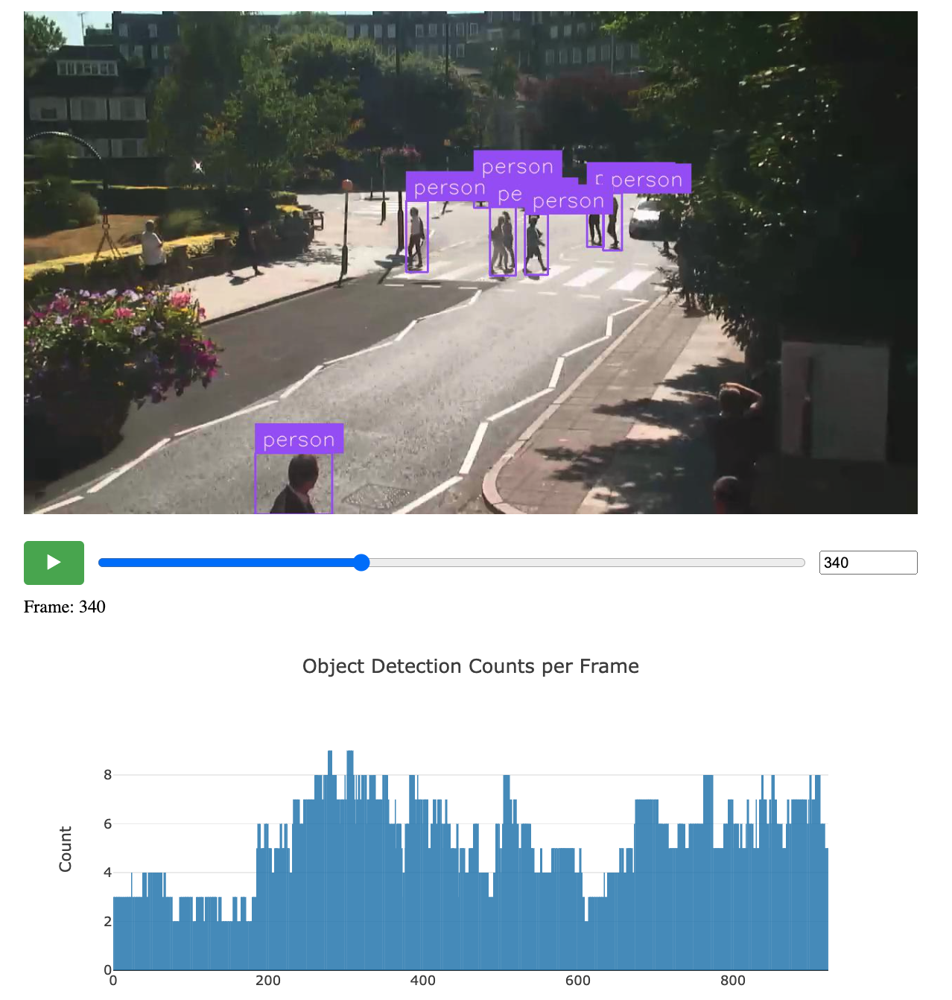

# Roboflow Workflow Analytics 🔍

📊 A powerful tool for analyzing and visualizing Roboflow workflow data, helping you gain insights into your computer vision pipelines!

## What does it do? 🤔

This tool helps you:

- 🔄 Monitor data processing pipelines
- 📊 Visualize workflows on videos
- 🕒 Analyze time series workflow data
- 🎯 Zero in on model performance

Perfect for ML engineers and teams who want to better understand their Roboflow workflows!


## Getting Started

1. Set up a Python environment. 
```bash
python3.11 -m venv venv
source venv/bin/activate
``` 

2. Install the dependencies:

```bash
pip install -r requirements.txt
``` 


3. Start local inference server:
```bash
inference server start
```

4. Start the web app:
```bash
python app.py
```

5. Open the web app in your browser:
```bash
http://127.0.0.1:8080/
```

6. Set the API key, workspace name, and workflow ID in the configuration section.



7. Run the pipeline to fetch and process workflow data:



8. Interact with the analytics dashboard to explore your workflow data:




